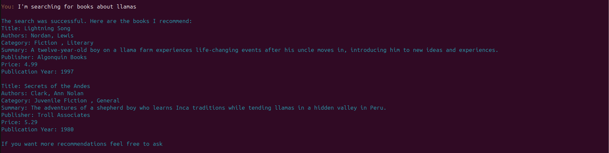
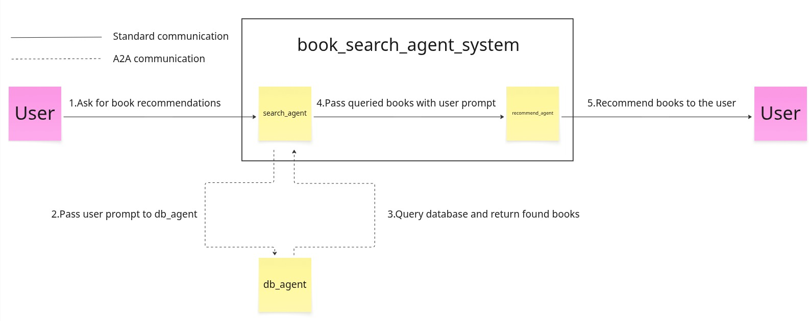
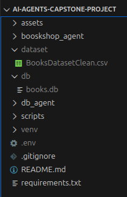

# AI Agents Capstone Project 2025 (Smart Bookshop Assistant)



**Capstone Project made as a part of [5-Day AI Agents Intensive Course with Google 2025](https://www.kaggle.com/learn-guide/5-day-agents)**   
**Category**: Enterprise Agents  
**Project Name**: Smart Bookshop Assistant

# Problem formulation
Let's imagine a following scenario:  
You are a student searching for some books on the topic of AI Agents. You could of course just type "AI Agents book" in the Google search or in any bookshop search system, yet after this you still need to manually check each suggestion and verify whether or not this is what you are looking for. What if you are searching for a certain topic related to AI Agents? The search can become very tedious quickly.

Solution - use AI Agents! AI Agents may use your message to select books that fit your criteria the best. Additionally they can give you a quick summary on each of the suggestions. That way you can quickly find interesting books without having to manually check each suggestion.

In this project we are using [Books Dataset by Elvin Rustamov](https://www.kaggle.com/datasets/elvinrustam/books-dataset) to simulate a virtual bookstore. We will be implementing a simple AI Agents System that will accept user message and return a recommended list of books. If no books are found that meet user criteria the system will communicate that to the user.

NOTE - this project is just a prototype! It's meant to show the strengths of AI Agents - not implement an actually working Bookshop website. We will use console to communicate with the AI Agents.

# System Architecture


How the system works:
1. The user asks about book recommendations e.g., books about history
2. search_agent accepts the user input. Using session memory it modifies the original user prompt (e.g., user doesn't like politics = the prompt will now include that user does not want history books related to politics). This prompt is passed using A2A protocol to the db_agent.
3. db_agent searches for authors, categories and keywords in the prompt it receives. Than it queries the database for books that meet the criteria. The list of books is passed to the search_agent
4. search_agent passes the list of books with the original user prompt to the recommend_agent
5. recommend_agent analyses the list of books and the original user prompt and selects books that fit user criteria best. The list is returned to the user in a form of text

# Features of the AI Agents System
This project utilizes:
- Multi-agent system, including any combination of:
    - Agent powered by an LLM (db_agent, search_agent, recommend_agent)
    - Sequential agents (book_search_agent_system)
- Tools, including:
    - custom tools (function to query database used by db_agent)
- Sessions & Memory
    - Sessions & state management (DatabaseSessionService)
- Observability: Logging (logging the performance of db_agent and book_search_agent_system)
- A2A Protocol (communication between db_agent and search_agent)

# Setup
The project was tested on Ubuntu 24.04.3 LTS and Python 3.12.3. I cannot guarantee that the project will work on other configurations.

## Clone repository

Clone the repository by typing the following commands in the terminal

```properties
git clone https://github.com/WiktorSa/AI-Agents-Capstone-Project
cd AI-Agents-Capstone-Project
```  

## Dataset download
[Download Books Dataset by Elvin Rustamov](https://www.kaggle.com/datasets/elvinrustam/books-dataset) and extract the .zip file  
Create dataset folder at the project level and place BooksDatasetClean.csv in it  

## Environment configuration
Create a .env file with a following configuration

```properties
GOOGLE_API_KEY=<Your Google AI Studio API Key>
```  
[You can generate your own Google AI Studio API Key here](https://aistudio.google.com/)

Create a virtual environment by running these commands in the console

```properties
python3 -m virtualenv venv
source venv/bin/activate
pip install --upgrade pip
pip install -r requirements.txt
```  

## Creating books database

Before you start experimenting with the AI Agents system you need to create a books database. Run the following commands in the console.

```properties
source venv/bin/activate
python -m scripts.create_books_db
```  

## Verifying configuration



Your configuration should look like this after doing all the commands above.

# Running
You'll need to open two terminals

In the first terminal type  
```properties
source venv/bin/activate
uvicorn scripts.a2a_db_agent:a2a_app --host localhost --port 8001
```  

This will start a server on which db_agent will be running. To test if the server runs correctly go to http://localhost:8001/.well-known/agent-card.json. If you see a proper json file it means that the server is running with no issues.

In the second terminal type
```properties
source venv/bin/activate
python -m scripts.run_bookshop_agent
```  

If everything is configured successfully you should be able to communicate with an AI Agent System using the second terminal. Type a message and wait for system response.

# Logging and other features
While communicating with the system you should notice the creation of the following files:
- db/bookshop_session.db (database that saves session memory)
- db/db_agent_data.db (database that saves failed queries and some part of successful queries for future analysis)
- logs/bookshop_agent_logs.log (track bookshop_agent work)
- logs/db_agent_logs.log (track db_agent work including success and failure of queries)

# Other scripts

You may run other scripts by typing in the console
```properties
source venv/bin/activate
python -m scripts.<script_name>
```  

**print_data_books_db** - see sample data that is stored in books database  
**query_books_db** - query the books database with sample queries  
**query_db_agent_db** - see query data stored during db_agent run  
**test_bookshop_agent** - test book_search_agent_system with sample messsages. NOTE - before you run the script you need to start the server that db_agent is running using uvicorn  
**test_db_agent** - test db_agent with sample messages  

# AI usage during development
Concept of the project and core parts of the system (architecture, main parts of the code) were implemented by me.

AI was used to refactor given parts of the code (including rephrasing the instruction for AI Agents).

# Acknowledgments
I'd like to thank Google for the course and opportunity to learn about AI Agents. I really enjoyed the course and what I've learned during these 5 days and while implementing this project.  
